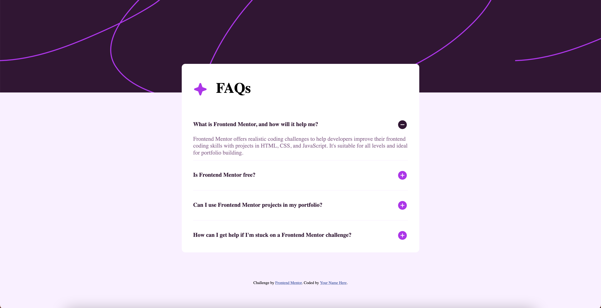

# Frontend Mentor - FAQ accordion solution

This is a solution to the [FAQ accordion challenge on Frontend Mentor](https://www.frontendmentor.io/challenges/faq-accordion-wyfFdeBwBz). Frontend Mentor challenges help you improve your coding skills by building realistic projects.

## Table of contents

- [Overview](#overview)
  - [The challenge](#the-challenge)
  - [Screenshot](#screenshot)
  <!-- - [Links](#links) -->
- [My process](#my-process)
  - [Built with](#built-with)
  - [What I learned](#what-i-learned)
  - [Continued development](#continued-development)
  - [Useful resources](#useful-resources)
- [Author](#author)
<!-- - [Acknowledgments](#acknowledgments) -->

**Note: Delete this note and update the table of contents based on what sections you keep.**

## Overview

### The challenge

Users should be able to:

- Hide/Show the answer to a question when the question is clicked
- Navigate the questions and hide/show answers using keyboard navigation alone
- View the optimal layout for the interface depending on their device's screen size
- See hover and focus states for all interactive elements on the page

### Screenshot



<!-- ### Links

- Solution URL: [Add solution URL here](https://your-solution-url.com)
- Live Site URL: [Add live site URL here](https://your-live-site-url.com) -->

## My process

### Built with

- Semantic HTML5 markup
- SCSS custom properties
- Flexbox
- CSS Grid

### What I learned

To see how you can add code snippets, see below:

```html
<h1>Some HTML code I'm proud of</h1>
```

How to declare a font face in scss

```scss
.ff {
    font-family: $font;
    src: url($url);
    font-weight: $value;
    font-style: normal;
}
```

```js
Array.from()
```

Although I ended up not using this section.

### Continued development

Flexbox and CSS Grid to talk about CSS and some of JS as well.

### Useful resources

- [Valeurs et unités CSS](https://developer.mozilla.org/fr/docs/Learn_web_development/Core/Styling_basics/Values_and_units) - This helped me to understand more about CSS values and units.

## Author

<!-- - Website - [Add your name here](https://www.your-site.com) -->
- Frontend Mentor - [@mathiasag7](https://www.frontendmentor.io/profile/mathiasag7)
<!-- - Twitter - [@MathiasAG3](https://www.twitter.com/MathiasAG3) -->